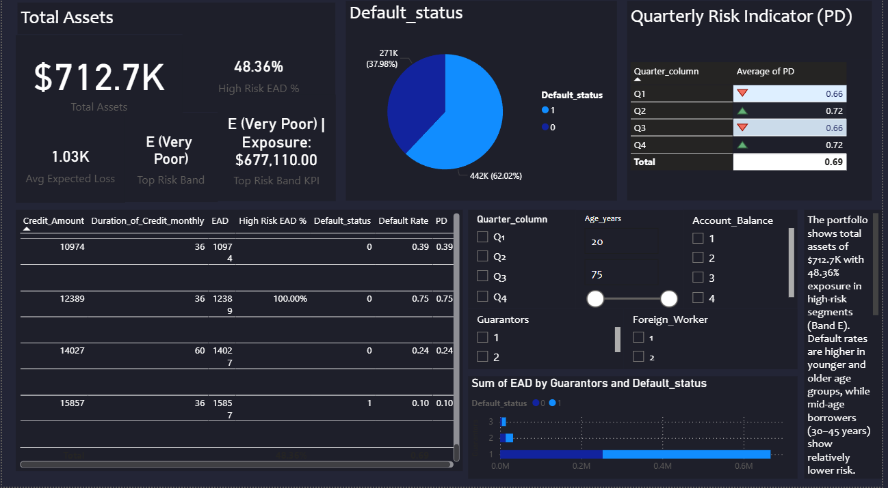
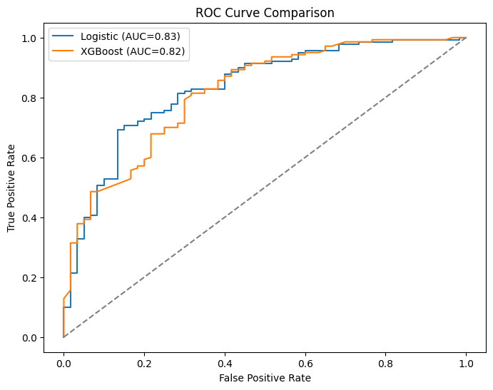
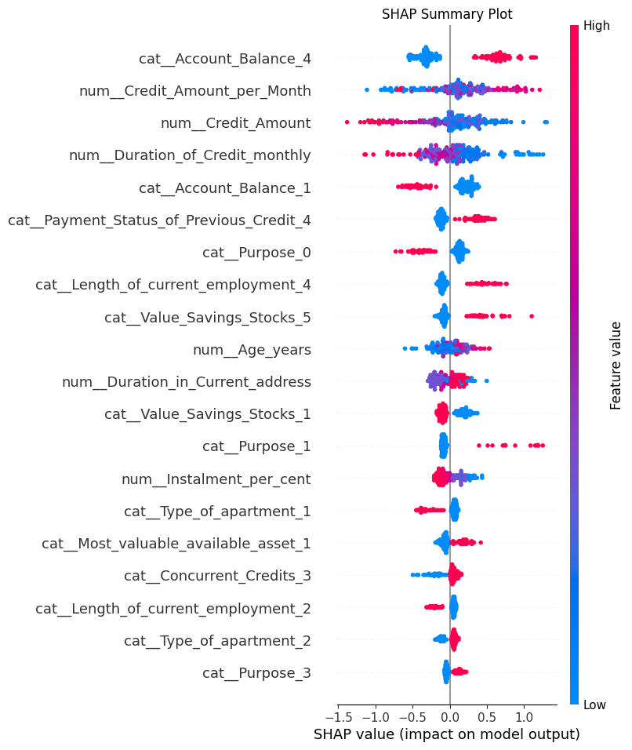
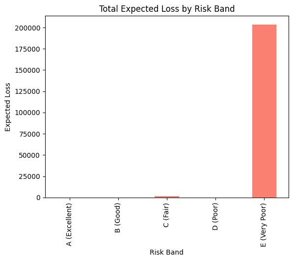

# 📊 Credit Risk Modeling and Dashboard

This project focuses on **credit risk assessment** using machine learning (Logistic Regression & XGBoost), probability of default (PD) calibration, SHAP explainability, and interactive dashboards in **Power BI**.  

The goal is to predict the likelihood of default, assign risk scores, and visualize portfolio risk distribution for actionable insights.  

---

## 📂 Project Structure

```bash
credit_risk_project/
├── data/                      # Raw and processed data files
│   ├── german.csv
│   ├── X_train.csv
│   ├── X_test.csv
│   ├── y_train.csv
│   ├── y_test.csv
│   └── preprocessor.pkl
│
├── notebooks/                 # Jupyter notebooks
│   ├── 01_eda.ipynb           # Exploratory Data Analysis
│   ├── 02_modeling.ipynb      # Modeling + SHAP Explainability
│   └── 03_risk_scoring.ipynb  # Risk Scoring + Banding
│
├── reports/                   # Saved plots, dashboards & outputs
│   ├── confusion_matrix.png
│   ├── correlation_heatmap.png
│   ├── dashboard.png
│   ├── expected_loss_by_band.png
│   ├── risk_band_distribution.png
│   ├── risk_score_distribution.png
│   ├── roc_comparison.png
│   ├── roc_logistic.png
│   ├── shap_local.png
│   └── shap_summary.png
│
├── requirements.txt           # Dependencies
└── README.md                  # Project documentation
```

---

## 🚀 Steps in the Project

### 🔹 Notebook 1: **Exploratory Data Analysis (EDA)**
- Inspected dataset & distributions  
- Checked missing values  
- Separated categorical & numeric features  
- Correlation heatmaps and visuals  

### 🔹 Notebook 2: **Modeling**
- Train/Test split  
- Baseline **Logistic Regression**  
- Advanced **XGBoost model** with calibration  
- **ROC-AUC Comparison** of Logistic vs XGBoost  
- **SHAP explainability** (feature importance + local explanations)  

### 🔹 Notebook 3: **Risk Scoring**
- Converted calibrated probabilities → **Probability of Default (PD)**  
- Scaled to **Risk Scores (0–1000)**  
- Assigned **Risk Bands (A–E)**  
- Calculated **Expected Loss (PD × EAD × LGD)**  

---

## 📊 Dashboard (Power BI)
The **interactive dashboard** highlights:  
- Total Assets and High-Risk Exposure  
- Default distribution  
- Quarterly PD trends  
- Risk band distribution  
- Expected Loss by band  
- Filters (Age, Guarantors, Account Balance, etc.)  



---

## 📈 Key Visuals
### ROC Curve Comparison  


### SHAP Summary (Global Explainability)  


### Expected Loss by Risk Band  


---

## ⚙️ Requirements
Install dependencies via:  

```bash
pip install -r requirements.txt

requirements.txt

pandas
numpy
scikit-learn
xgboost
matplotlib
seaborn
shap
joblib

📝 Future Improvements

Deploy as a web app (Streamlit/Dash)

Automate pipeline with MLflow

Connect directly with live credit data feeds

✨ Author: Sumedha Baghmar
📌 Built with Python, Power BI, and 💙
